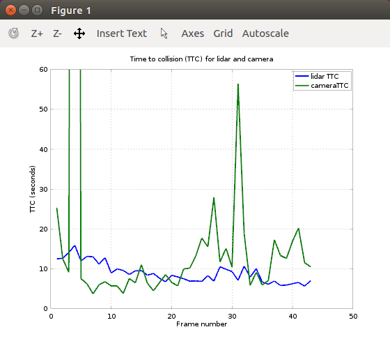

# Final Report:

This is the Final report for the camera/lidar based 3D object tracking
project. Below I describe the performance of the time to collision
(TTC) estimates for lidar and camera individually.

## FP.1 Match 3D Objects   
3D-bounding boxes are matched between frames based on the number of point correspondences. This was implemented [here](https://github.com/mdmosley1/SFND_3D_Object_Tracking/blob/85dd3622030d08074ffcc4e7cf4fd66dd1becc61/src/camFusion_Student.cpp#L306-L352).

## FP.2 Compute Lidar-based TTC
Lidar-based TTC was computed based on the equation presented in the lecture. The median values of the pointclouds were used in order to be statistically robust. The implementation can be found [here](https://github.com/mdmosley1/SFND_3D_Object_Tracking/blob/52341807253d542a692eae6881be3d5b2acd9273/src/camFusion_Student.cpp#L225-L252).

## FP.3 Associate Keypoint Correspondences with Bounding Boxes
Keypoints were associated with bounding boxes by using OpenCV's Rect::contains() method to check if a keypoints lies inside a bounding box's ROI. This was implemented [here](https://github.com/mdmosley1/SFND_3D_Object_Tracking/blob/fef73100fc5ba0dc40b46d45b37f0210ba69ff0b/src/camFusion_Student.cpp#L133-L154).

## FP.4 Compute Camera-based TTC
Camera-based TTC was determined by computing distance ratios between feature pairs in the current image and last image. The mean distance ratio was used in the TTC equation to provide a statistically robust TTC estimate. This was implemented [here](https://github.com/mdmosley1/SFND_3D_Object_Tracking/blob/92b7c415fc1eaf4c571b1376a98337f1cf6a8fef/src/camFusion_Student.cpp#L157-L214).

## FP.5 Performance Evaluation 1: Lidar TTC
There are some instances where the TTC increases from one frame to the
next, even though this is probably inaccurate. One contributing
factor is that we are using a constant velocity model for the vehicle,
despite the fact that the vehicle is gradually slowing down throughout
the duration of the dataset. Another factor is that the median lidar
point does not always capture the same physical location on the
vehicle every frame.

## FP.6 Performance Evaluation 2: Camera TTC
Based on experimentation, using a combination of the ORB feature
detector and the BRISK feature descriptor yields the most accurate
results. There are, however, a few cases where the camera TTC is
drastically different from the lidar TTC. I attribute this to
occasional bad feature matches across frames. For the most part, these
can be remedied by taking the median distance ratio. But there are a
few bad frames where even this does not help.

